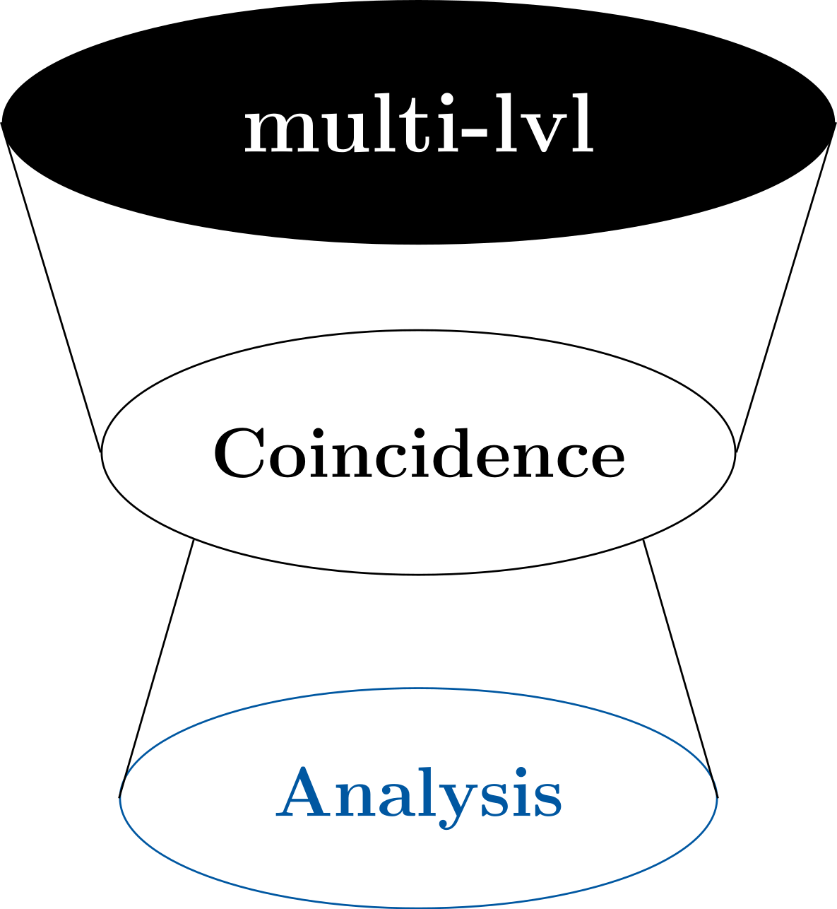

[](https://www.gnu.org/licenses/gpl-3.0)
[](https://multi-lvl-coincidence-analysis.readthedocs.io/en/latest/)

# multi-Lvl-Coincidence-Analysis

<p align="center" width="100%">
     
</p>

multi-Lvl-Coincidence-Analysis (mLCA) is a Python package for causal-mechanistic modeling. The core function of the package is to derive causal-mechanistic models from coincidence data tables. The resulting models are visualized using Ti<em>k</em>Z.


## Installation

We recommend to install the required Python packages from environment.yml using mamba or conda. 
```
$ mamba env create -f environment.yml
```
This sets up the 'mlca' environment, including all necessary packages in their compatible versions.
Running the main script further requires a TeX distribution installed on the system, as well as the Ti<em>k</em>Z library for TeX.

## Usage

We provide a graphical interface. To run it go to src/mlca and type:
```
$ python gui.py
```
It offers three modes to pass the coincidence data to mLCA.
1. via an interactive table  
First, set the number of variables (columns) and of configurations (rows) to the correct values. You can then click on any field to change its value from 0 to 1 or vice versa. The initially empty row at the bottom is for separating the constitutive levels and optionally for defining a causal ordering like it is possible in QCA and cna. '<<' means that the variable corresponding to this column and all to its right are of a higher constitutive level than those to its left. Similarly, '<' means that this variable and those to its right are of higher causal order within the same constitutive level compared to the variables to the left of this column.
The table is automatically saved as a csv-file in the directory csv_files once you click on the button 'Run mLCA', which initialises the generation of possible causal-mechanistic models.
2. from a csv file stored on the system  
Select 'Import data from csv' in top menu and click on 'Select File' to open a file selector. After selecting the required file click on 'Run mLCA'.
3. from the output of either QCA or cna saved in a text file  
Select 'Import data from QCA/CNA' in top menu and click on 'Select File' to open a file selector. After selecting the required file click on 'Run mLCA'.

After calculating the possible models, their visualizations are displayed on the right part of the GUI. You can browse through the different models using the buttons 'Previous' and 'Next'. To zoom use 'Zoom in' and 'Zoom out'. 
The generated hypergraphs are also saved in a separate pdf-file in the output directory.

You can also use the command line application. In this case you can choose between the options 2. and 3. from above. You have to specify the path to your data table by replacing 'PATH' in
```
$ python cli.py --csv PATH
```
Alternatively, when using mLCA alongside the R packages cna or QCA, you have to save the output from these packages in a textfile (see the R-scripts in the samples folder for an instruction on how to do this) and indicate the path to this file with 
```
$ python cli.py --r-import PATH
```
If any causal ordering has been defined in cna or QCA, it will be reinterpreted as level separation in mLCA.

Further optional arguments can be appended:
* "-bw" (alternatively "--blackwhite") changes the output from colored graphs into black/white. The argument "-c" (resp. "--color") forces the color mode, which is currently set as default.
* If the tex-formated formulae should be exported into a separate file, the optional argument "-fl" (or "--fulllist") should be set.
* By default complex relations between co-extensive variables are excluded, which makes mLCA for single level models comparable to cna. If all possible models should be generated, this can be done by adding the argument "-c" or "--complex".

### Preparing the data tables

When using the second option, you have to prepare the coincidence table first. The following syntax is required by mLCA. The table head of the csv-table should contain the labels for the causal factors. Different variables must have different labels and a label must not be a substring of another variable's label. 
The following entries in the cells in the table body are interpreted as True: "1", "T", "t", "w", "W", "true", "True". The strings "0", "F", "f", "false", "False" are interpreted as False.
Admissible column separators are ":", ",", ";", "|" and "_".
  
It is possible to include information on the causal order and on constitutive levels. In order to do so, add the following separators after the last row of truth values:
* The entry "<<" is interpreted as level-separator. The respective factor and those of the columns to its right are assigned to a higher level than those factors corresponding to the columns to its left.
* The character "<" marks the causal stream within the same constitutive level. Variables in columns to the left cannot be effects to the variable associated with this column or to its right.

### Customizing the graphical output

The causal-mechanistic hypergraphs are generated using the TeX-template file Latex_Template.tex in the config folder. You can modify it at will to change all further outputs. You can also modify the generated output_graph.tex to customize an individual hypergraph.

## Documentation

see docs or on <https://multi-lvl-coincidence-analysis.readthedocs.io/en/latest/index.html>

## samples

The folder samples contains some examples for truth tables in csv-format or R-scripts that make use of the cna-package. Some of the examples model multi-level mechanisms.

**sample_1**
> single level causal structure

**sample_2**
> a simple two-level structure 

**sample_3**
> a complex three-level structure

## License

The code in this repository, including all code samples is released under the [GPL-3.0 license](LICENSE.txt).
